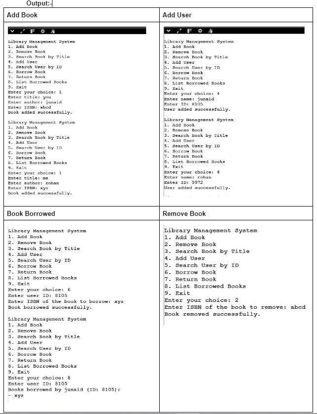
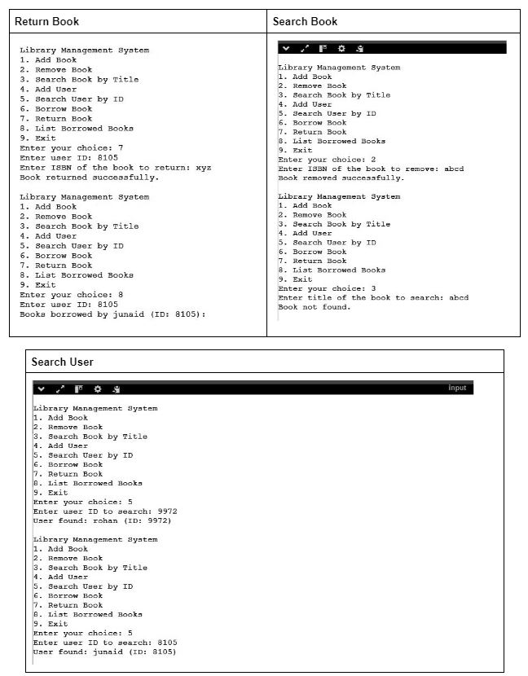

# C
This is my 4th semester Advance data structure with c language
 
1.<a href="main.c">Library Management System</a> <--- Click Here to view the code 

<b>Constraints:</b> 
Implement the system to handle borrowing and returning books, ensuring that rules, such as a maximum of 5 books per user, are enforced.  

<b>Implement the following operations:</b>  
<b>Book Management: </b> 
Add several books to the collection.  
Remove a book by its ISBN.  
Search for books by their title.  
<b>User Management: </b> 
Add several users to the system.  	Search for a user by their ID.  
<b>Transaction Management: </b> 
Borrow books for various users and ensure that the system correctly tracks the borrowed books.  
Return books and verify that the availability status of the books is updated.  
List the books currently borrowed by each user.  

 
 
 
